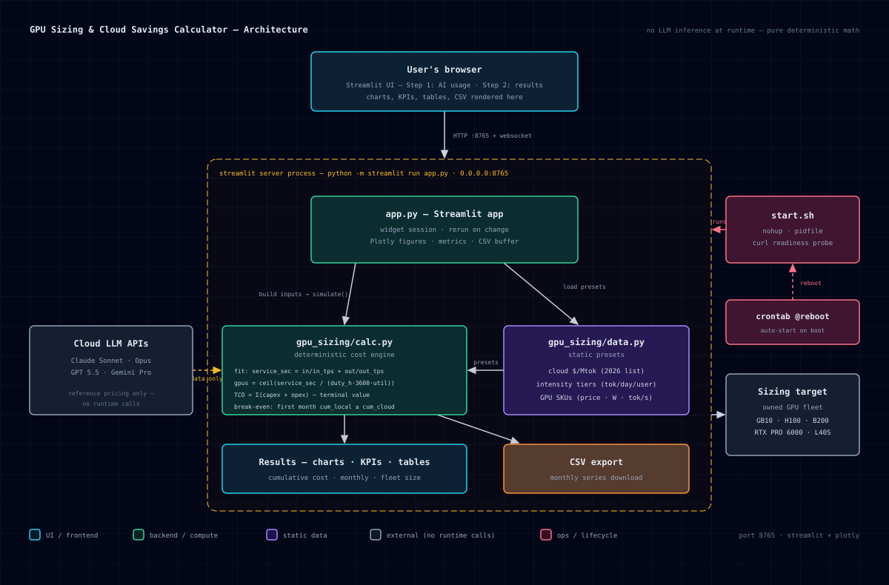

# GPU Sizing & Cloud Savings Calculator

A TCO calculator in the spirit of AMD's [AI Cost Calculator](https://tokenomics.amd.com/),
adapted for datacenter/consumer **GPUs**: size a GPU fleet for your AI workload and
compare owned-hardware spend against cloud API spend over a chosen period.

- **Port:** 8765 (bound to 0.0.0.0 so the second cluster box can reach it)
- **Stack:** Streamlit + Plotly, pure-Python calc engine (`gpu_sizing/calc.py`)

## What it does

**Step 1 — Your AI usage** (sidebar)

- Per-user daily token volume (input/output) with Light / Moderate / Heavy presets
  (tiered off the AMD source-workload volumes), user count, active days/month,
  month-over-month demand growth
- Cloud pricing: 2026 list $/1M tokens for Claude Sonnet, Claude Opus, GPT 5.5,
  Gemini Pro, or custom; optional weighted **model mix**; adjustments for prompt
  cache hits, batch discount, overhead %, fixed monthly fees
- Coverage slider: % of workload served locally (hybrid mode) vs cloud

**Step 2 — Your results** (main)

- GPU selection (GB10, RTX PRO 6000 Blackwell, H100, B200, L40S, A100, custom)
  with editable price, wattage and sustained tok/s (in/out) — calibrate to your own
  vLLM benchmarks, that's the biggest lever
- Power & ownership: $/kWh, PUE, duty hours, PUE days/month, maintenance
  $/GPU/month, target utilization, hardware life, residual value, discount rate
- Outputs:
  - **Break-even month** (cumulative local vs cumulative all-cloud)
  - **Savings over the period** (absolute and %)
  - Local TCO, NPV, all-cloud total, GPUs required (peak), utilization
  - Cumulative cost chart (all-cloud / all-local / hybrid) with break-even marker
  - Monthly cost chart, fleet-size chart
  - Cost detail tables, 3-scenario break-even sensitivity, CSV export

## Architecture



*Browser preview: open `docs/architecture.html` in any browser (dark theme, no dependencies).*

Key property: **no LLM inference at runtime** — the engine is pure deterministic
Python. Cloud LLM APIs appear in the diagram only as a static pricing reference;
the owned GPU fleet on the right is what the tool sizes, not something it calls.

## The math (same structure as AMD's tokenomics)

```
service_seconds/day = in_daily/in_tps + out_daily/out_tps        (per GPU)
required_gpus       = ceil(service_seconds / (duty_h*3600*target_util))
local TCO           = Σ monthly (capex + opex) − terminal fleet value
  opex = units * watts/1000 * duty_h * days * PUE * $/kWh + units * hosting
  capex via cohort simulation (buy-as-you-grow, retire after life, residual resale)
  NPV discounts at the chosen annual rate
cloud_monthly       = tokens_in/1e6 * $in * input_factor * common
                    + tokens_out/1e6 * $out * common + fixed
  input_factor = 1 − cache_hit + cache_hit*0.10   (cached reads ~10% of base)
  common       = (1 − batch_disc) * (1 + overhead)
break-even          = first month where cum_local ≤ cum_cloud
```

## Run

```bash
bash /home/jeff/projects/gpu-sizing/start.sh     # idempotent, port 8765
bash /home/jeff/projects/gpu-sizing/stop.sh
tail -f /home/jeff/projects/gpu-sizing/gpu-sizing.log
```

Auto-starts on reboot via `@reboot /home/jeff/projects/gpu-sizing/start.sh` in crontab.

## Layout

```
app.py                 Streamlit UI
gpu_sizing/data.py     cloud model prices, intensity presets, GPU presets
gpu_sizing/calc.py     Demand / CloudPricing / GpuSpec / Ownership / simulate()
docs/architecture.svg  architecture diagram (embedded above)
docs/architecture.html browser preview of the diagram
start.sh, stop.sh      lifecycle helpers (nohup + pidfile, curl readiness)
```

## Caveats

- GPU tok/s figures are order-of-magnitude for ~7–14B models via vLLM; real
  throughput varies with model size, context length, batching, and quantization.
- Cloud list prices change frequently. Estimates only — not financial advice.
